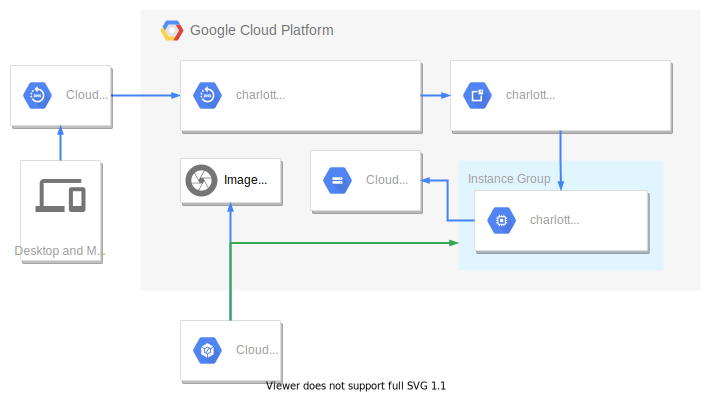

# Stacks

> Hosting Wordpress on the cheap.

## Architecture



## Stacks

There are 2 main stacks in use.

- `charlotte-website-dns-deployment`
- `charlotte-website-compute-deployment`

### Creating

```bash
gcloud deployment-manager deployments create <stack_name> \
    --config <stack_template>.yaml
```

## Updating

To update the cloud infrastructure run:

```bash
gcloud deployment-manager deployments update <stack_name> \
    --config <stack_template>.yaml \
    --preview
```

> The `preview` flag allows you to create the stack without creating the resources.

In some cases changes cannot be applied to the existing stack, meaning the stack under deployment manager has to be deleted first. Then the new updated stack can be created by running the create command.
